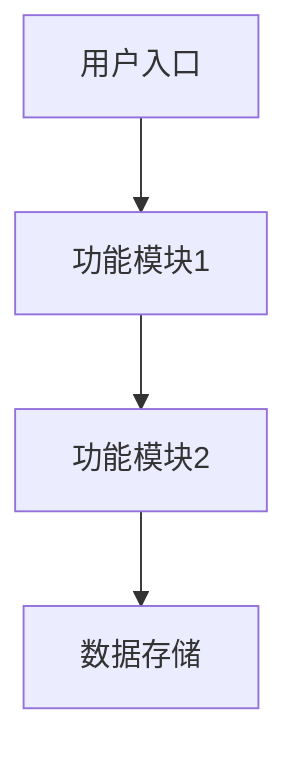
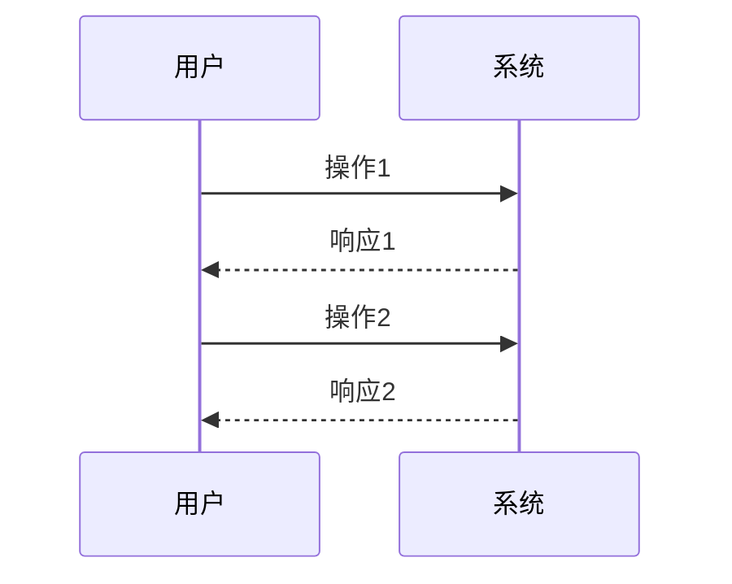

# 输出文档模板

## 通用说明

**严格按模板生成**：
- 所有输出文档必须严格按照对应模板的结构和章节生成
- 不得添加模板之外的内容、章节或说明
- 不得添加额外的标题、签名、日期等元信息
- 模板中标注为"可选"的章节可根据实际情况决定是否生成

---

## 目录

- [需求合理性评估报告](#需求合理性评估报告)
- [功能需求文档模板](#功能需求文档模板)
- [原型说明文档模板](#原型说明文档模板)
- [TFS需求分析文档模板](#tfs需求分析文档模板)

---

## 需求合理性评估报告

**文件名**：`[需求号]_需求设计_01_需求合理性评估报告.md`

**严格按照模板生成，不得添加额外内容**

```markdown
# 需求合理性评估报告

## 一、需求概述

- **需求背景**: [业务背景说明，说明提出需求的业务场景和原因]
- **需求描述**: [客户原始需求，直接引用客户的表述]
- **提出方**: [需求来源，如XX科室、XX系统]
- **产品名称**: [关联的产品/模块名称]

## 二、需求解读

### 2.1 业务场景理解

[对业务场景的理解和分析，包括当前存在的问题、用户的真实诉求]

### 2.2 核心诉求识别

- **主要诉求**: [核心需要解决的问题]
- **次要诉求**: [附带需要满足的需求]

### 2.3 功能识别

基于需求描述，识别出以下功能点：

| 功能编号 | 功能名称 | 功能描述 | 优先级 |
|----------|----------|----------|--------|
| F1 | [功能1名称] | [功能简要描述] | P0/P1/P2 |
| F2 | [功能2名称] | [功能简要描述] | P0/P1/P2 |
| F3 | [功能3名称] | [功能简要描述] | P0/P1/P2 |

## 三、五维评估

### 3.1 需求合理性（5分制）

**评分**: [1-5分]

| 维度 | 评分 | 说明 |
|------|------|------|
| 业务逻辑自洽性 | [1-5] | [需求是否符合业务逻辑，是否有自相矛盾之处] |
| 技术实现可行性 | [1-5] | [当前技术条件下是否可以实现，不含具体技术方案] |
| 需求边界清晰度 | [1-5] | [需求的边界和范围是否明确清晰] |
| 业务场景真实性 | [1-5] | [业务场景是否符合实际，是否存在虚构场景] |
| 合规性 | [1-5] | [是否符合公司业务规范和行业法规] |

**综合评分**: [1-5分]

**评估说明**: [根据评分说明需求合理性的整体评价]

### 3.2 需求必要性（5分制）

**评分**: [1-5分]

| 维度 | 评分 | 说明 |
|------|------|------|
| 解决痛点程度 | [1-5] | [是否解决了实际业务痛点，痛点的严重程度] |
| 使用频率预期 | [1-5] | [预期使用频率如何，高频/中频/低频] |
| 用户覆盖范围 | [1-5] | [覆盖用户数量，全院/科室/个人] |
| 业务价值贡献 | [1-5] | [对业务价值的贡献程度，效率提升/成本降低等] |
| 紧迫程度 | [1-5] | [需求的紧急程度，是否影响正常业务开展] |

**综合评分**: [1-5分]

**评估说明**: [根据评分说明需求必要性的整体评价]

### 3.3 现有功能兼容性（5分制）

**评分**: [1-5分]

| 维度 | 评分 | 说明 |
|------|------|------|
| 功能重复度 | [1-5] | [是否与现有功能重复，重复程度如何] |
| 系统一致性 | [1-5] | [与现有系统设计风格和交互模式是否一致] |
| 数据兼容性 | [1-5] | [数据格式和结构是否与现有系统兼容] |
| 流程协调性 | [1-5] | [与现有业务流程是否协调，是否会冲突] |
| 维护成本影响 | [1-5] | [对系统维护成本的影响程度] |

**综合评分**: [1-5分]

**评估说明**: [根据评分说明现有功能兼容性的整体评价]

**功能清单对比**:
- [ ] 已核对功能清单，确认是否为重复需求
- [如存在重复功能]：重复的功能点为：[列出重复的功能点]，差异为：[说明差异]

### 3.4 新功能完整性（5分制）

**评分**: [1-5分]

| 维度 | 评分 | 说明 |
|------|------|------|
| 功能点覆盖 | [1-5] | [功能点是否完整，是否有明显遗漏] |
| 输入输出明确 | [1-5] | [输入输出是否明确，数据格式是否清晰] |
| 异常处理考虑 | [1-5] | [是否考虑了异常情况和边界条件] |
| 业务闭环性 | [1-5] | [功能是否形成业务闭环，是否存在断点] |
| 扩展性考虑 | [1-5] | [是否考虑了未来扩展的可能性] |

**综合评分**: [1-5分]

**评估说明**: [根据评分说明新功能完整性的整体评价]

### 3.5 业务相关性（5分制）

**评分**: [1-5分]

| 维度 | 评分 | 说明 |
|------|------|------|
| 战略契合度 | [1-5] | [与产品战略方向的契合程度] |
| 业务条线关联 | [1-5] | [与所属业务条线的关联程度] |
| 跨条线影响 | [1-5] | [对其他业务条线的影响程度] |
| 数据关联度 | [1-5] | [与核心业务数据的关联程度] |
| 流程关联度 | [1-5] | [与核心业务流程的关联程度] |

**综合评分**: [1-5分]

**跨条线识别**: [如涉及跨条线需求，说明涉及的条线及关联关系]

**评估说明**: [根据评分说明业务相关性的整体评价]

## 四、需求分级

### 4.1 综合评分汇总

| 评估维度 | 得分 | 满分 | 得分率 |
|----------|------|------|--------|
| 需求合理性 | [ ] / 25 | 25 | [ ]% |
| 需求必要性 | [ ] / 25 | 25 | [ ]% |
| 现有功能兼容性 | [ ] / 25 | 25 | [ ]% |
| 新功能完整性 | [ ] / 25 | 25 | [ ]% |
| 业务相关性 | [ ] / 25 | 25 | [ ]% |
| **总计** | **[ ]** / **125** | **125** | **[ ]%** |

### 4.2 需求分级

**分级结果**: [S/A/B/C]

| 等级 | 分数范围 | 说明 |
|------|----------|------|
| **S级** | ≥100分 | 重要且紧急，启用快速通道处理 |
| **A级** | 80-99分 | 合理且必要，按正常流程处理 |
| **B级** | 60-79分 | 存在疑问，需要澄清后处理 |
| **C级** | <60分 | 不合理或不必要，建议驳回 |

### 4.3 复杂度预判

**复杂度**: [简单/复杂/无法判断]

| 复杂度 | 说明 |
|--------|------|
| **简单** | 单一功能，逻辑清晰，无复杂交互 |
| **复杂** | 多功能联动，业务逻辑复杂，涉及多系统集成 |
| **无法判断** | 缺少关键技术或业务信息，需要研发评估 |

### 4.4 需求本质分析

**本质判断**: [真实需求/伪需求/设计漏洞]

**分析依据**:
1. **问题1**：客户是否真正理解自己的需求？
   - [是/否] [说明]
2. **问题2**：提出的解决方案是否真的能解决问题？
   - [是/否] [说明]
3. **问题3**：是否是现有产品的问题，而非需求本身的问题？
   - [是/否] [说明]

**本质判定**: [根据三个问题的回答，判定需求本质]

**建议**:
- [如为伪需求]：建议与客户进一步沟通，挖掘真实诉求
- [如为设计漏洞]：建议优化现有产品设计，而非新增功能
- [如为真实需求]：建议按正常流程推进

## 五、完整性评估

### 5.1 已明确信息

- [信息1]
- [信息2]
- [信息3]

### 5.2 待澄清问题

| 问题 | 原因 | 建议提问 |
|--------|----------|------|
| [问题1] | [为什么需要澄清这个问题] | [建议向客户提问的方式] |
| [问题2] | [为什么需要澄清这个问题] | [建议向客户提问的方式] |
| [问题3] | [为什么需要澄清这个问题] | [建议向客户提问的方式] |

**待澄清问题数量**: [X] 个

## 六、初步建议

- **建议1**: [具体的改进或实施建议]
- **建议2**: [具体的改进或实施建议]
- **建议3**: [具体的改进或实施建议]

## 七、下一步行动

- [ ] 确认待澄清问题
- [ ] 补充需求细节
- [ ] [根据分级确定下一步：S级快速通道 / A级正常流程 / B级澄清后处理 / C级驳回]

> **注意**：
> - 技术可行性评估（具体技术方案、数据可获取性、系统兼容性）属于研发设计阶段，不在此阶段评估
> - 页面布局设计在功能需求文档阶段完成
> - 本评估报告采用五维评估框架（依据《需求管理办法V1.1》），确保评估的标准化和可追溯性
> - 评分标准详见 [evaluation-criteria.md](../../std-req-eval/references/evaluation-criteria.md)
```

---

## 功能需求文档模板

**文件名**：`[需求号]_需求设计_02_功能需求.md`

**严格按照模板生成，不得添加额外内容**

```markdown
# [功能名称] 功能需求文档

## 一、产品定位（必填）

### 1.1 核心价值

[说明产品/功能解决的核心问题和提供的价值]

### 1.2 产品形态

- **载体**: [Web/App/小程序/桌面应用等]
- **场景**: [使用场景描述，如科室日常办公、医疗管理等]

### 1.3 差异化优势

[与现有方案相比的优势，或创新点]

### 1.4 目标

- **短期目标**: [近期要达成的目标，如提升查询效率30%]
- **长期目标**: [远期规划，如全面覆盖XX业务]

## 二、目标用户（必填）

### 2.1 用户分类

| 用户类型 | 描述 | 优先级 |
|----------|------|--------|
| 核心用户 | [主要使用该功能的用户群体] | P0 |
| 次要用户 | [偶尔使用该功能的用户群体] | P1 |
| 潜在用户 | [未来可能使用该功能的用户群体] | P2 |

### 2.2 核心用户画像

- **角色**: [角色名称，如医疗组管理员]
- **职责**: [工作职责描述]
- **痛点**: [当前面临的痛点或问题]
- **期望**: [期望该功能带来的改善]

## 三、客户需求（必填）

- **需求背景**: [业务背景说明，说明为什么会有这个需求]
- **需求描述**: [客户原始需求描述]
- **提出方**: [需求来源]

### 3.1 澄清问题

| 问题 | 原因 | 确认 |
|--------|----------|------|
| [问题1] | [为什么提出这个问题] | [客户的回答或确认] |
| [问题2] | [为什么提出这个问题] | [客户的回答或确认] |
| [问题3] | [为什么提出这个问题] | [客户的回答或确认] |

## 四、功能需求（必填）

### 4.1 核心功能 (P0 - Must have)

| 功能名称 | 功能描述 | 核心作用 |
|----------|----------|----------|
| [功能1] | [详细描述该功能的用途和效果] | [该功能解决了什么问题] |
| [功能2] | [详细描述该功能的用途和效果] | [该功能解决了什么问题] |

### 4.2 重要功能 (P1 - Should have)

| 功能名称 | 功能描述 | 核心作用 |
|----------|----------|----------|
| [功能1] | [详细描述该功能的用途和效果] | [该功能解决了什么问题] |
| [功能2] | [详细描述该功能的用途和效果] | [该功能解决了什么问题] |

### 4.3 次要功能 (P2 - Could have)

| 功能名称 | 功能描述 | 核心作用 |
|----------|----------|----------|
| [功能1] | [详细描述该功能的用途和效果] | [该功能解决了什么问题] |

### 4.4 不在本期实现 (P3 - Won't have)

| 功能名称 | 不实现原因 | 后续计划 |
|----------|------------|----------|
| [功能1] | [如技术限制、优先级低等] | [如二期再实现] |

## 五、页面布局（可选）

### 5.1 页面层级

[页面结构说明，使用树形结构展示]

```
[系统名称]
└── [功能模块名称]
    ├── [页面区域1]
    ├── [页面区域2]
    └── [页面区域3]
```

### 5.2 核心页面布局

**必须使用 ASCII 字符画方框图形式直观展示页面布局**，禁止使用纯文字描述或代码块。

**参考格式**（见 workflow-guide.md "页面布局示例"章节）：

**查询条件区（页面顶部）**
```
┌─────────────────────────────────────────────────────────────────┐
│ [页面标题]                                                      │
├─────────────────────────────────────────────────────────────────┤
│ 查询条件1: [控件]    查询条件2: [控件]    查询条件3: [控件]      │
│                                                                 │
│ 查询条件4: [控件]    查询条件5: [控件]                            │
├─────────────────────────────────────────────────────────────────┤
│ [查询按钮] [重置按钮]                                           │
└─────────────────────────────────────────────────────────────────┘
```

**数据展示区（页面中部）**
```
┌─────────────────────────────────────────────────────────────────┐
│ [表格视图] [其他视图]                           [导出] [打印]  │
├─────────────────────────────────────────────────────────────────┤
│ 列1 │ 列2 │ 列3 │ 列4 │ 列5 │ 列6 │ 列7 │ 列8 │ 列9 │ 操作   │
├─────┼─────┼─────┼─────┼─────┼─────┼─────┼─────┼─────┼────────┤
│ ... │ ... │ ... │ ... │ ... │ ... │ ... │ ... │ ... │ ...    │
│ ... │ ... │ ... │ ... │ ... │ ... │ ... │ ... │ ... │ ...    │
└─────┴─────┴─────┴─────┴─────┴─────┴─────┴─────┴─────┴────────┘
```

**布局说明**：
- 使用 `┌─┐│└┘├─┤` 等 ASCII 字符绘制方框图
- 清晰展示页面各个区域的排列方式和控件布局
- 标注各个区域的名称和功能

## 六、交互设计（可选）

### 6.1 通用交互规则

- [规则1]
- [规则2]
- [规则3]

### 6.2 核心功能交互

[关键交互流程说明，包括正常流程和分支流程]

**正常流程**：
1. 用户操作1
2. 系统响应1
3. 用户操作2
4. 系统响应2

**异常流程**：
- 当[异常情况]发生时，提示[提示信息]

### 6.3 异常处理

| 异常场景 | 处理方式 |
|----------|----------|
| [场景1] | [具体处理方式，如提示错误信息、引导用户操作等] |
| [场景2] | [具体处理方式] |

## 七、补充需求（可选）

### 7.1 性能需求

- [性能要求，如查询响应时间不超过3秒]
- [数据量支持，如支持10万条数据查询]

### 7.2 安全需求

- [安全要求，如权限控制、数据加密等]
- [访问控制，如只有管理员可访问]

### 7.3 兼容性需求

- [浏览器兼容性要求]
- [设备兼容性要求]
- [与现有系统的集成要求]

### 7.4 数据需求（产品角度）

- [数据来源，如现有系统、第三方等]
- [数据更新频率，如实时、每日、每周等]
- [数据保留周期，如6个月、1年、永久等]
- [数据范围说明，如全院数据、科室数据等]

> **注意**：
> - 本文档从产品经理角度描述功能需求
> - 不涉及数据库表结构、字段定义、接口设计等研发阶段内容
> - 技术实现细节在详细设计阶段由研发团队完成
```

---

## 原型说明文档模板

**文件名**：`[需求号]_需求设计_03_原型说明.md`

**严格按照模板生成，不得添加额外内容**

**重要说明**：
- `${VIEWER_PATH}` 是查看器路径占位符，需要在生成文档时动态替换
- 使用 `tools/setup-viewer-path.mjs get` 工具获取实际路径
- 获取到路径后，将模板中的 `${VIEWER_PATH}` 替换为实际路径
- 如果工具返回 `found: false`，需输出配置指南给用户

```markdown
# [功能名称] 原型说明文档

## 一、原型概述

### 1.1 设计说明

- **技术栈**: Vue 2 + WinDesign 组件库
- **设计原则**: 精确还原功能需求文档中的页面布局和交互设计
- **文件结构**: 说明前端代码的文件组织方式

### 1.2 组件依赖

列出使用的主要 WinDesign 组件：
- [组件1]: [使用场景]
- [组件2]: [使用场景]
- [组件3]: [使用场景]

## 二、页面结构

### 2.1 页面文件组织

```
src/
├── components/
│   ├── [组件1].vue
│   └── [组件2].vue
├── views/
│   └── [主页面].vue
└── App.vue
```

### 2.2 组件层级关系

[使用树形结构展示组件之间的嵌套关系]

```
[主页面]
├── [查询条件组件]
├── [统计汇总组件]
├── [数据展示组件]
│   ├── [表格视图组件]
│   └── [时间轴视图组件]
└── [操作按钮组件]
```

## 三、功能实现说明

### 3.1 核心功能实现

**功能1**: [功能名称]
- **实现方式**: [说明如何实现该功能]
- **关键代码**: [关键代码片段说明]
- **交互细节**: [交互行为的详细说明]

**功能2**: [功能名称]
- **实现方式**: [说明如何实现该功能]
- **关键代码**: [关键代码片段说明]
- **交互细节**: [交互行为的详细说明]

### 3.2 数据流转

**数据来源**: [说明数据如何获取]

**数据状态管理**:
```javascript
data() {
  return {
    [数据项1]: [初始值],
    [数据项2]: [初始值],
    [数据项3]: [初始值]
  }
}
```

**数据处理逻辑**: [说明数据的处理和转换逻辑]

### 3.3 事件处理

**查询事件**:
```javascript
handleQuery() {
  // 处理查询逻辑
}
```

**重置事件**:
```javascript
handleReset() {
  // 处理重置逻辑
}
```

**导出事件**:
```javascript
handleExport() {
  // 处理导出逻辑
}
```

## 四、样式说明

### 4.1 整体样式

- **主题**: 使用的主题样式
- **布局**: 整体布局方式（如 Flex 布局）
- **响应式**: 响应式设计说明

### 4.2 自定义样式

[说明自定义的样式及其作用]

```css
/* 自定义样式示例 */
.custom-class {
  /* 样式说明 */
}
```

## 五、交互说明

### 5.1 用户操作流程

[使用步骤说明用户的操作流程]

1. 用户操作步骤1
2. 系统响应
3. 用户操作步骤2
4. 系统响应

### 5.2 组件交互

[说明组件之间的交互方式]

- **父组件 → 子组件**: [交互方式]
- **子组件 → 父组件**: [交互方式]
- **组件间通信**: [使用的事件或状态管理方式]

### 5.3 路由管理

```javascript
// 路由配置说明
{
  path: '/[路由路径]',
  name: '[路由名称]',
  component: [组件名称]
}
```

### 5.4 异常处理

| 异常场景 | 处理方式 | 用户提示 |
|----------|----------|----------|
| [场景1] | [具体处理方式] | [提示信息] |
| [场景2] | [具体处理方式] | [提示信息] |

## 六、测试建议

### 6.1 功能测试

- [功能点1]: [测试建议]
- [功能点2]: [测试建议]
- [功能点3]: [测试建议]

### 6.2 兼容性测试

- **浏览器**: [支持浏览器列表]
- **分辨率**: [支持的分辨率范围]
- **设备**: [支持的设备类型]

### 6.3 性能测试

- [性能指标1]: [测试建议]
- [性能指标2]: [测试建议]

## 七、原型查看

### 7.1 使用 prototype-viewer 预览

本原型为 Vue 组件格式，使用 prototype-viewer 服务预览。

━━━━━━━━━━━━━━━━━━━━━━━━━━━━━━━━━━━━━━━━
🚀 快速开始
━━━━━━━━━━━━━━━━━━━━━━━━━━━━━━━━━━━━━━━━

❓ 首次使用吗？请往下看「第一次使用」
✓ 已经安装过依赖？直接看「日常使用」

━━━━━━━━━━━━━━━━━━━━━━━━━━━━━━━━━━━━━━━━
📦 第一次使用（安装依赖）
━━━━━━━━━━━━━━━━━━━━━━━━━━━━━━━━━━━━━━━━

Step 1 ➜ 打开命令行（Win+R，输入 cmd，回车）

Step 2 ➜ 进入查看器目录
```bash
cd ${VIEWER_PATH}
```

Step 3 ➜ 安装依赖（仅需一次，约1-2分钟）
```bash
npm install
```

Step 4 ➜ 启动服务
```bash
npm run dev
```

Step 5 ➜ 浏览器自动打开，选择原型预览

━━━━━━━━━━━━━━━━━━━━━━━━━━━━━━━━━━━━━━━━
⚡ 日常使用（依赖已安装）
━━━━━━━━━━━━━━━━━━━━━━━━━━━━━━━━━━━━━━━━

```bash
cd ${VIEWER_PATH}
npm run dev
```

浏览器自动打开后，选择对应原型预览。

━━━━━━━━━━━━━━━━━━━━━━━━━━━━━━━━━━━━━━━━
💡 小贴士
━━━━━━━━━━━━━━━━━━━━━━━━━━━━━━━━━━━━━━━━

✓ 依赖只需安装一次，所有原型永久共用
✓ 服务已启动时，刷新浏览器（F5）即可查看新原型
✓ 关闭服务：在命令行按 Ctrl+C
✓ 服务端口：http://localhost:3000

━━━━━━━━━━━━━━━━━━━━━━━━━━━━━━━━━━━━━━━━
❓ 常见问题
━━━━━━━━━━━━━━━━━━━━━━━━━━━━━━━━━━━━━━━━

Q: npm 不是内部或外部命令
A: 需先安装 Node.js，访问 nodejs.org 下载安装

Q: 浏览器没自动打开
A: 手动打开浏览器，访问 http://localhost:3000

Q: 看不到新做的原型
A: 点击页面右上角的「刷新」按钮，或按 F5

Q: 依赖安装失败
A: 检查网络连接，或尝试使用淘宝镜像：
```bash
npm install --registry=https://registry.npmmirror.com
```

**文件位置**：
```
过程文件/[需求号]/prototype/
├── src/
│   ├── main.js
│   ├── App.vue
│   └── views/[页面名称].vue
```

### 7.2 技术说明

- 前端框架：Vue 2.7
- UI组件库：WinDesign（`w-` 前缀）
- 预览服务：prototype-viewer（本地安装，依赖共用）
- 依赖位置：`${VIEWER_PATH}/node_modules/`

### 7.3 注意事项

- 依赖只需安装一次，所有原型共用
- 无需网络连接，依赖已本地安装
- 服务已启动时，刷新浏览器即可查看新原型
- 建议使用现代浏览器（Chrome、Firefox、Edge、Safari）
```

---

## TFS需求分析文档模板

**文件名**：`[需求号]_需求设计_04_TFS需求分析.md`

> # ⚠️⚠️⚠️ 生成前必须阅读以下警告 ⚠️⚠️⚠️
>
> ## 禁止事项（违反将导致文档无法上传到TFS）
>
> | ❌ 禁止项 | 原因 |
> |----------|------|
> | 添加 `# TFS需求分析` 或任何 `#` 开头的 h1 标题 | TFS字段不支持 |
> | 在文档开头添加 `---` 分隔线 | 破坏格式 |
> | 添加签名、日期、版本号等元信息 | 不需要 |
> | 生成"三、实施建议"章节 | 研发设计内容 |
> | 包含功能优先级、实施风险、工作量评估 | 研发设计内容 |
>
> ## ✅ 正确格式
>
> **文档开头必须这样**：
> ```markdown
> ## 一、需求概述
>
> ### 1.1 背景现状
> ...
> ```
>
> **❌ 错误格式**：
> ```markdown
> # TFS需求分析
>
> ## 一、需求概述
> ...
> ```

---

**严格按照模板生成，不得添加额外内容**

**重要说明**：
- 本文档用于上传到 TFS 的 `Winning.Demand.Analysis` 字段
- 内容必须精简，从"一、需求概述"开始，不得包含其他前置内容
- 不得包含文档标题（如"# TFS需求分析文档"）、表格头部、项目信息等额外内容
- 不要生成"三、实施建议"章节
- 不包含功能优先级、实施风险、工作量评估、技术方案等内容

```markdown
## 一、需求概述

### 1.1 背景现状

[描述当前的业务背景和现状，包括现有系统情况、存在的问题等]

### 1.2 客户诉求

[描述客户的具体需求和期望解决的问题]

## 二、需求分析

### 2.1 功能分析

#### 2.1.1 功能范围

| 功能模块 | 功能点 | 优先级 | 说明 |
|----------|--------|--------|------|
| [模块1] | [功能1] | P0/P1/P2 | [功能说明] |
| [模块2] | [功能2] | P0/P1/P2 | [功能说明] |

#### 2.1.2 业务流程

[使用文字或流程图描述业务流程]

#### 2.1.3 数据流程

[描述数据在系统中的流转过程]

### 2.2 受影响的模块/流程/关联需求

#### 2.2.1 受影响模块

| 模块 | 影响内容 | 影响程度 |
|------|----------|----------|
| [模块名] | [影响说明] | 高/中/低 |

#### 2.2.2 关联需求

| 关联类型 | 说明 |
|----------|------|
| 上游需求 | [关联的上级需求] |
| 下游需求 | [关联的下级需求] |

#### 2.2.3 流程变更

[说明需要变更的流程及变更内容]

### 2.3 测试注意事项

#### 2.3.1 功能测试要点

| 测试项 | 测试内容 | 预期结果 |
|--------|----------|----------|
| [测试项1] | [测试内容] | [预期结果] |
| [测试项2] | [测试内容] | [预期结果] |

#### 2.3.2 边界测试

| 测试项 | 测试内容 |
|--------|----------|
| [边界测试1] | [测试内容] |
| [边界测试2] | [测试内容] |

#### 2.3.3 性能测试

| 测试项 | 测试内容 |
|--------|----------|
| [性能测试1] | [测试内容] |

### 2.4 原型设计说明（如有原型设计）

> **本章节仅在存在原型设计时添加**，特别是涉及新功能页面或页面布局设计时，必须包含本章节内容，方便开发人员阅读实现。

#### 2.4.1 功能架构图

[描述功能模块的整体架构关系，可使用 Mermaid 流程图或文字描述]



#### 2.4.2 功能详细说明

[针对原型中的每个功能页面/组件进行详细说明]

| 页面/组件 | 功能描述 | 关键字段 | 交互说明 |
|-----------|----------|----------|----------|
| [页面1] | [功能描述] | [字段1、字段2] | [交互说明] |
| [页面2] | [功能描述] | [字段1、字段2] | [交互说明] |

#### 2.4.3 交互设计（可选）

[描述页面间的跳转关系、状态变化、用户操作流程等关键交互设计]



> **注意**：
> - 本文档从产品经理角度进行需求分析
> - 关注业务价值、用户体验、功能实现
> - 不涉及数据库表结构、字段定义、接口设计等技术实现细节
> - 技术实施方案在详细设计阶段由研发团队完成
> - 原型设计说明章节应在有原型设计时包含，特别是新功能页面或页面布局设计
```

---

## 模板使用说明

### 使用时机

- **需求合理性评估报告**：在阶段1完成需求评估后生成
- **功能需求文档**：在阶段3确认需求完整后生成
- **原型说明文档**：在阶段4完成原型设计后生成
- **TFS需求分析文档**：在阶段5完成原型设计后生成

### 注意事项

1. **灵活调整**：根据实际需求调整模板内容，不是所有章节都需要填写
2. **标记必填项**：模板中标注"（必填）"的章节必须填写
3. **保持一致性**：确保三个文档之间内容的一致性和连贯性
4. **用户确认**：每个阶段的输出都需要用户确认后才能进入下一阶段
