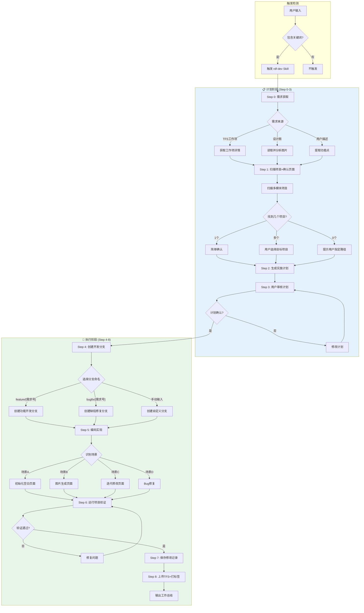
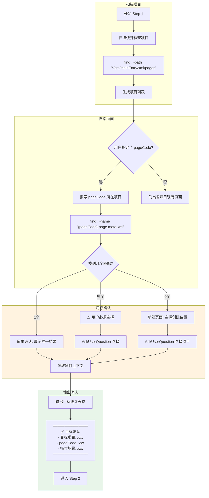
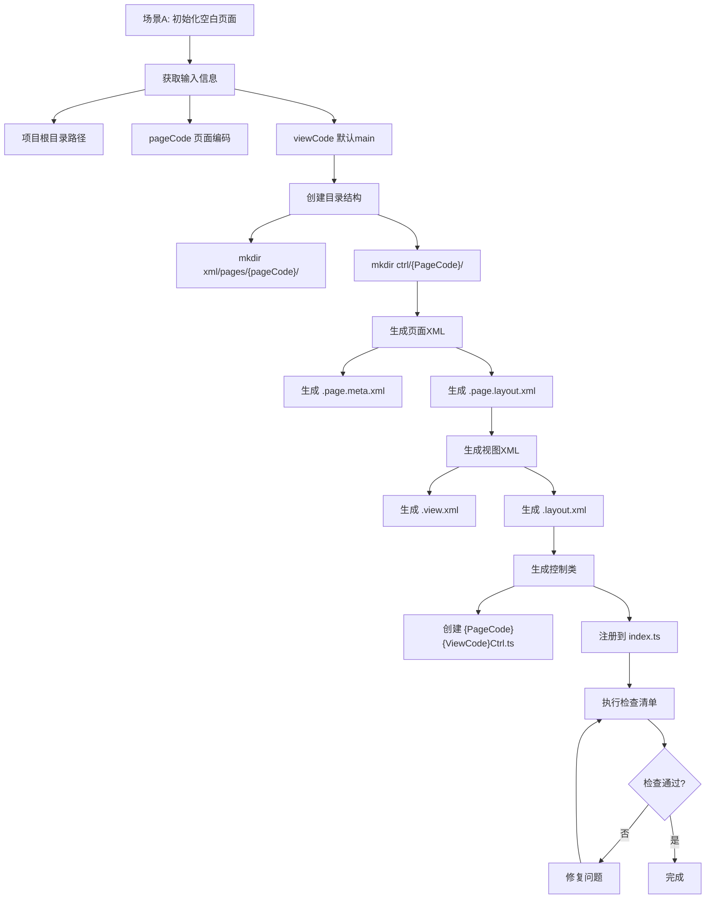
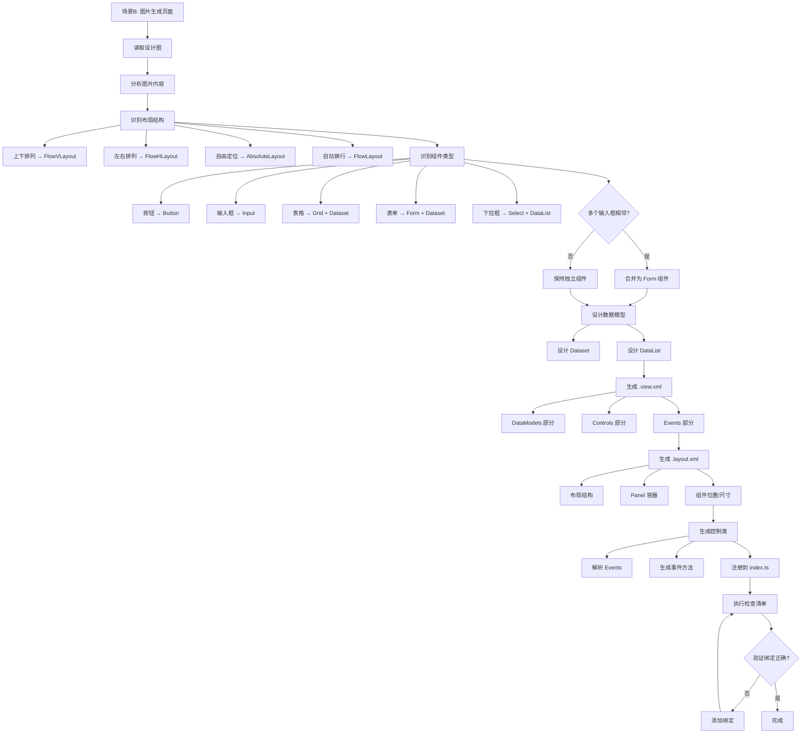
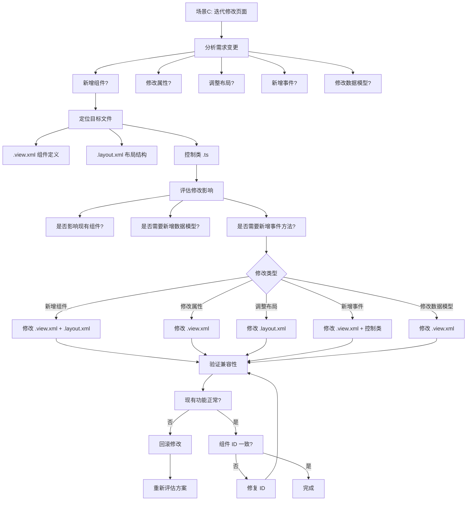
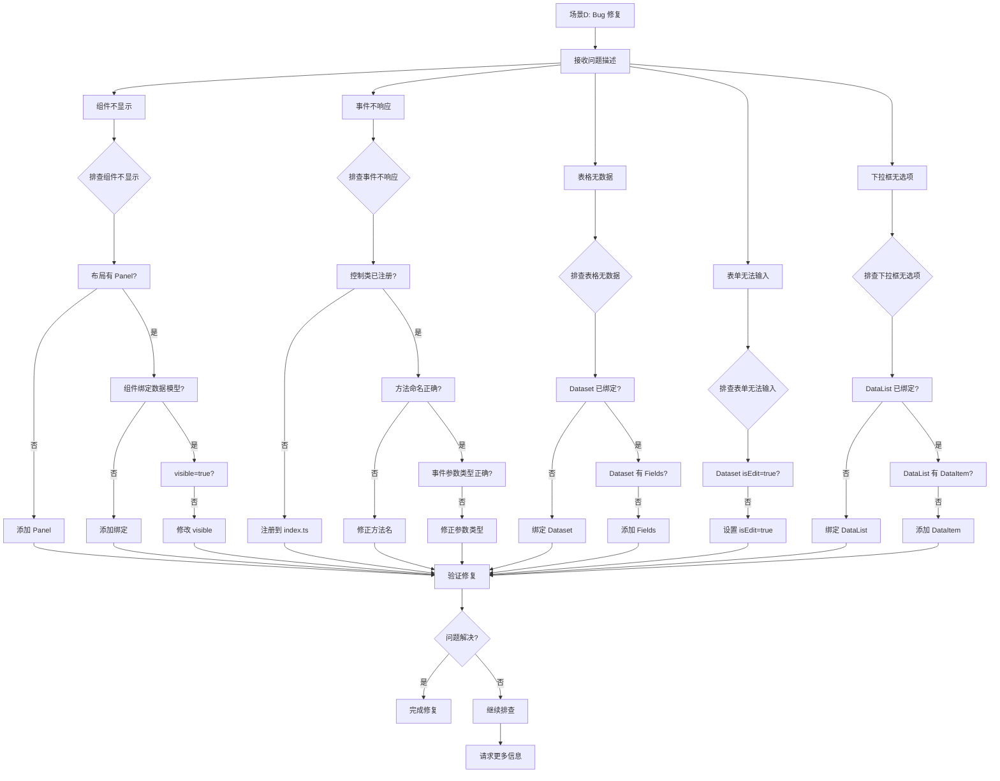
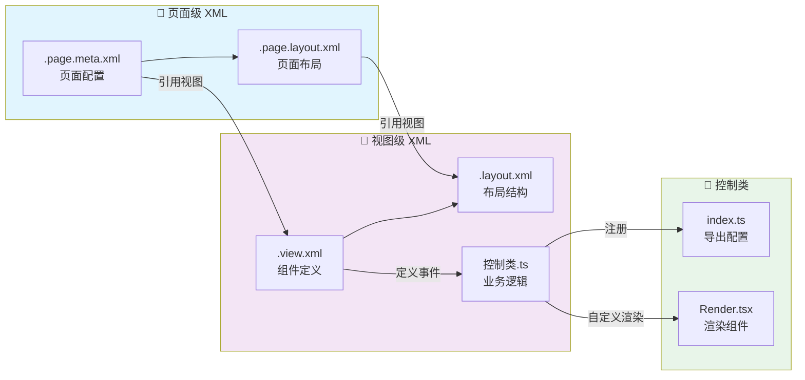

# 快开框架（RDF）开发 Skill 流程图

## 整体工作流程



---

## Step 1: 多模块项目确认流程（详细）



---

## Step 5: 编码实现场景流程

### 场景A: 初始化空白页面



---

### 场景B: 图片生成页面



---

### 场景C: 迭代修改页面



---

### 场景D: Bug 修复



---

## 检查点流程

```mermaid
flowchart LR
    subgraph 计划阶段检查
        A1[需求来源已确认]
        A2[TFS 工作项已获取]
        A3[附件已下载]
        A4[**已扫描多模块项目**]
        A5[**已确认目标项目**]
        A6[**用户确认目标页面**]
        A7[生成实施计划]
        A8[用户确认计划]
    end

    subgraph 执行阶段检查
        B1[Git 状态检查]
        B2["分支命名规范(feature/bugfix/自定义)"]
        B3[文件路径正确]
        B4[pageCode 大小写一致]
        B5[Dataset/DataList 绑定]
        B6[组件 ID 一致]
        B7[布局 Panel 正确]
        B8[控制类已注册]
        B9[事件方法命名规范]
    end

    subgraph 验证阶段检查
        C1[运行项目]
        C2[页面加载正常]
        C3[组件渲染正常]
        C4[事件响应正常]
        C5[保存修改记录]
        C6[上传 TFS]
    end

    A1 --> A2 --> A3 --> A4 --> A5 --> A6 --> A7 --> A8
    A8 --> B1 --> B2 --> B3 --> B4 --> B5 --> B6 --> B7 --> B8 --> B9
    B9 --> C1 --> C2 --> C3 --> C4 --> C5 --> C6

    style A4 fill:#ffeb3b
    style A5 fill:#ffeb3b
    style A6 fill:#ffeb3b
```



---

## 文件关系图



---

## 目录结构

```
{项目根目录}/
├── src/mainEntry/
│   ├── xml/pages/{pageCode}/
│   │   ├── {pageCode}.page.meta.xml      # 页面配置
│   │   ├── {pageCode}.page.layout.xml    # 页面布局
│   │   ├── {pageCode}.{viewCode}.view.xml    # 视图定义
│   │   └── {pageCode}.{viewCode}.layout.xml  # 视图布局
│   └── ctrl/{PageCode}/
│       ├── {PageCode}{ViewCode}Ctrl.ts   # 控制类
│       ├── {PageCode}Render.tsx          # 渲染组件（可选）
│       └── index.ts                      # 注册导出
├── docs/
│   ├── plans/
│   │   └── yyyy-mm-dd-需求号.md          # 实施计划
│   └── feature/
│       ├── yyyy-mm-dd-需求号.md          # 修改记录
│       └── AI-CODING-log-yyyy-mm-dd.txt     # 对话导出
└── product-docs/
    └── {需求号}/                         # 需求文档
        ├── 设计图.png
        └── 需求说明.docx
```

---

## 多模块项目示例

```
工作目录/
├── wn-his-web/                    # HIS 系统
│   ├── src/mainEntry/
│   │   ├── xml/pages/
│   │   │   ├── userManage/        # 用户管理页面
│   │   │   └── patientQuery/      # 患者查询页面
│   │   └── ctrl/
│   ├── .sparkrc.ts
│   └── package.json
│
├── wn-emr-web/                    # EMR 系统
│   ├── src/mainEntry/
│   │   ├── xml/pages/
│   │   │   ├── userManage/        # 用户管理页面（同名）
│   │   │   └── emrEditor/         # 病历编辑页面
│   │   └── ctrl/
│   ├── .sparkrc.ts
│   └── package.json
│
└── wn-lis-web/                    # LIS 系统
    ├── src/mainEntry/
    │   ├── xml/pages/
    │   │   └── sampleManage/      # 样本管理页面
    │   └── ctrl/
    ├── .sparkrc.ts
    └── package.json
```

**⚠️ 注意**: 当 `userManage` 在多个项目中存在时，Step 1 会要求用户确认目标项目。

---

## 触发关键词

| 类别 | 关键词 |
|-----|-------|
| 框架名称 | 快开框架、RDF、rdf、pango-framework |
| 编码标识 | pageCode、viewCode |
| 文件类型 | .page.meta.xml、.view.xml、.layout.xml |
| 操作动词 | 生成页面、创建页面、初始化页面、开发需求 |
| 修改动词 | 修改组件、调整布局、添加事件 |
| 问题关键词 | 组件不显示、事件不响应、表格无数据 |

---

## 常见问题排查表

| 现象 | 可能原因 | 排查步骤 | 解决方案 |
|-----|---------|---------|---------|
| 组件不显示 | 布局缺少 Panel | 检查 .layout.xml | 添加 FlowVPanel/FlowHPanel |
| 组件不显示 | 组件未绑定数据模型 | 检查 dataset/datalist 属性 | 添加数据模型绑定 |
| 组件不显示 | visible=false | 检查 visible 属性 | 设置 visible="true" |
| 事件不响应 | 控制类未注册 | 检查 index.ts | 添加注册 |
| 事件不响应 | 方法命名错误 | 检查方法名格式 | 使用 组件ID+事件名 格式 |
| 事件不响应 | 事件参数类型错误 | 检查泛型参数 | 使用正确的事件类型 |
| 表格无数据 | Dataset 未绑定 | 检查 Grid 的 dataset 属性 | 绑定 Dataset |
| 表格无数据 | Dataset 无 Fields | 检查 Fields 定义 | 添加 Field 元素 |
| 表单无法输入 | Dataset isEdit=false | 检查 Dataset 的 isEdit | 设置 isEdit="true" |
| 下拉框无选项 | DataList 未绑定 | 检查 Select 的 datalist 属性 | 绑定 DataList |
| 下拉框无选项 | DataList 无 DataItem | 检查 DataItem 定义 | 添加 DataItem 元素 |
